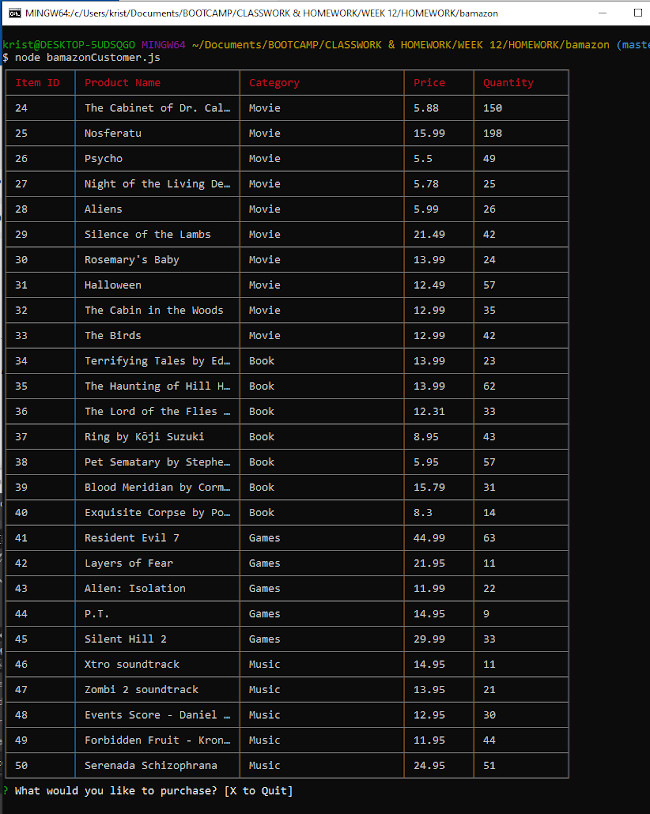
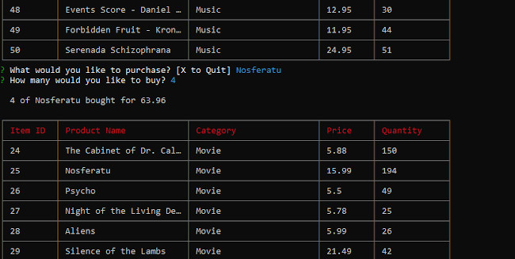
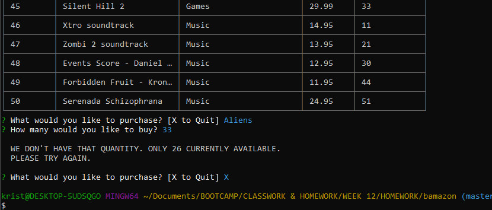

# bAmazon Storefront
_created by Krista Clarke (github - loraxgirl)_ 
**An Amazon-like storefront made with MySQL**

## Assignment Details
**UCLA Full-stack Web Development Bootcamp - Week 12 Homework** 
Created an Amazon-like storefront with MySQL, Javascript, and Node.js. The app takes in orders from customers, checks available inventory, totals the sale and updates inventory. 

## How To Use
On startup, bAmazon displays all available products, with price and available inventory.
It will ask what product you would like to purchase. Type in product name.
It will then ask what quantity. Type in quantity. If you ask for more than are available, bAmazon will let you know.
If there are enough in inventory, your purchase will be completed.

### Technologies Used
* JavaScript
  * Node.js
    * Inquirer Packet
    * DotEnv Packet
    * CLI-Table

* MySQL

### Screenshots Of The App In Action
**_Purchase_** On startup, displays table with entire bAmazon inventory.

**_Purchase & Inventory Update_** Enter product name and desired quantity. Confirmation message with total amount. Then displays table with updated inventory.

**_Insufficient Quantity_** If customer tries to order more than available quantity, bAmazon notifies customer and returns them to the order prompt.

### Future Enhancements
This could be served on a website, giving more user accessibility and functionality. As-is, with the manager-level controls not detailed in this Read Me, this could be the framework for a small storefront.
